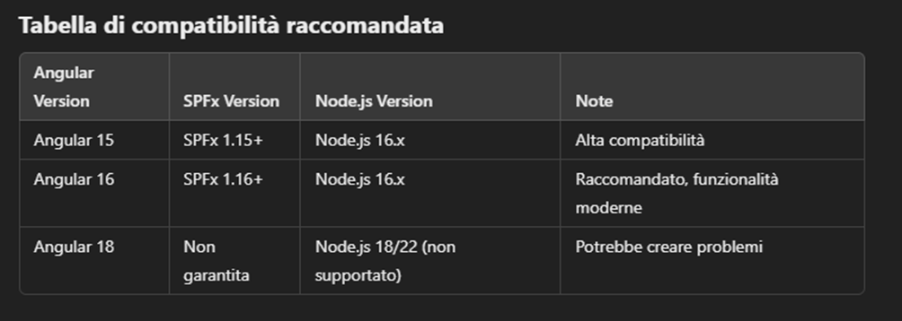

Nota: sto utilizzando angular 16 (configurazione 2 della tabella di cui sopra)

Prerequisiti

Verifica la versione di SPFx installata:
npm ls @microsoft/sp-core-library

Configura Node.js con NVM:
nvm use 16

Installa Yeoman e il generatore SPFx:
npm install -g yo @microsoft/generator-sharepoint

Installa Angular CLI (versione 16):
npm install -g @angular/cli@16

Passaggi per creare il progetto

Genera la soluzione SPFx:
yo @microsoft/sharepoint

Durante il setup:
•	Nome della soluzione: angular-spfx-webpart
•	Base della soluzione: ./angular-spfx-webpart
•	Seleziona “No JavaScript framework” (perché Angular non è nativo in SPFx).
•	Fornisci i dettagli della web part (es. nome e descrizione).
•	Scegli SharePoint Online only o un'opzione adatta al tuo scenario.

posizionarsi nel progetto angular ed eseguire il comando di compilazione :

ng build --configuration production

copiare il contenuto della cartella /dist di angular nella webpart di angular creata precedentemente.

spfx-project --> src --> webparts --> myWebPart --> angularApp

adeguare i percorsi dei file angular nella webpart predefinita helloWorld nel file HelloWorldWebPart.ts

adeguare nel file serve.json l'initial page per angular

"initialPage": "http://localhost:8000/index.html"

Per avviare il progetto :

avviare sharepoint: 

spostarsi nel progetto spfx : spfx-progect
eseguire comando : gulp serve

avviare angular:

spostarsi nella webpart di angular : spfx-progect\src\webparts\myWebPart\angularApp

eseguire comando (nel mio caso sto utilizzando il server in python) : python -m http.server 8000

